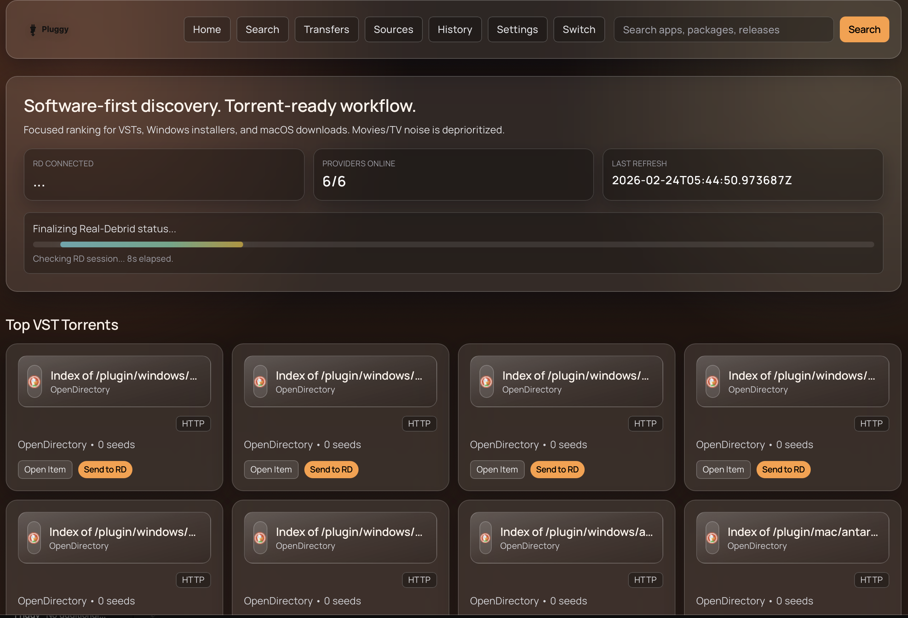
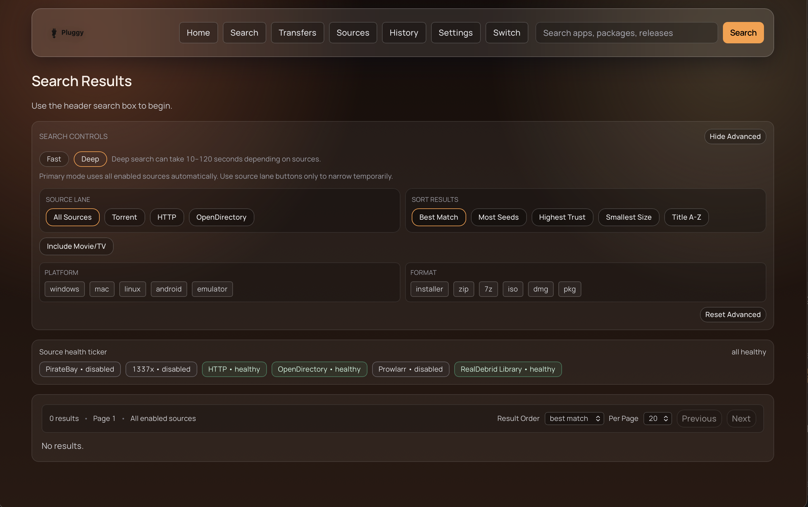
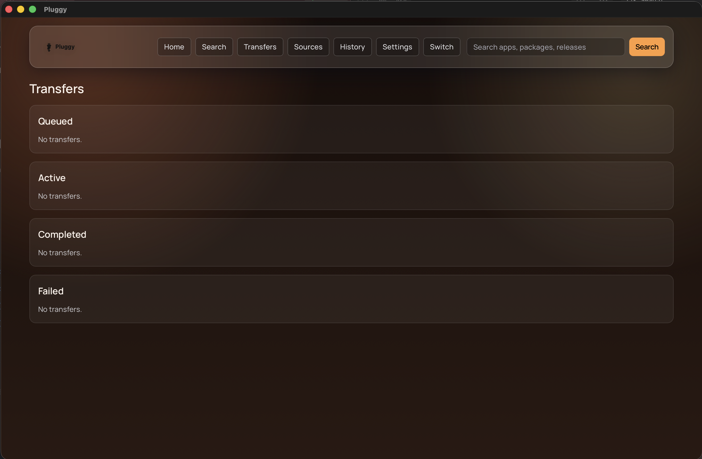
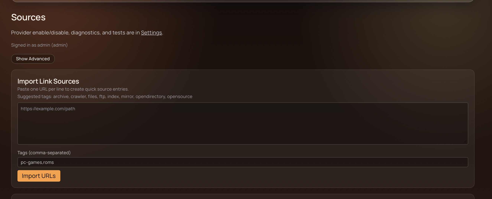
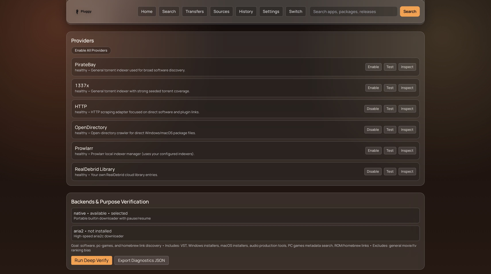

<p align="center">
  
</p>

```
██████╗ ██╗     ██╗   ██╗ ██████╗  ██████╗██╗   ██╗
██╔══██╗██║     ██║   ██║██╔════╝ ██╔════╝╚██╗ ██╔╝
██████╔╝██║     ██║   ██║██║  ███╗██║  ███╗ ╚████╔╝ 
██╔═══╝ ██║     ██║   ██║██║   ██║██║   ██║  ╚██╔╝  
██║     ███████╗╚██████╔╝╚██████╔╝╚██████╔╝   ██║   
╚═╝     ╚══════╝ ╚═════╝  ╚═════╝  ╚═════╝    ╚═╝
```

**one search. every source. zero noise.**

*Multi-engine search & download utility for VSTs, plugins, and software.*

---



---

Pluggy aggregates results from multiple search engines — torrent indexers, HTTP sources, open directories, Prowlarr, and your Real-Debrid library — into a single search workflow. Ranking and filtering are tuned for software and plugin discovery rather than general media.

---

## Table of Contents

* [Search](#search)
* [Ranking & Filters](#ranking--filters)
* [Download & Transfer](#download--transfer)
* [HTTP Sources](#http-sources)
* [Open Directory Engine](#open-directory-engine)
* [Real-Debrid](#real-debrid)
* [Profiles & Auth](#profiles--auth)
* [Source Management & Diagnostics](#source-management--diagnostics)
* [UI](#ui)
* [Releases (macOS app + DMG)](#releases-macos-app--dmg)
* [Getting Started](#getting-started)
* [Configuration](#configuration)
* [Architecture](#architecture)
* [Notes](#notes)

---

## Search

Searches all enabled providers concurrently using a thread pool. Results appear incrementally as providers respond.

* **Fast** and **Deep** search modes with configurable timeouts
* Early-return mode stops scanning once a sufficient number of results exist
* Results are deduplicated by infohash, URL, and title across all sources
* Matching results from different sources are grouped into a single item with multiple link candidates; a best link is selected per group
* Each provider tracks attempt/success/failure/latency and receives a routing score
* Providers that fail repeatedly are temporarily skipped via a circuit breaker and retried after a cooldown period
* Transient failures retry automatically with backoff
* An LRU + TTL cache prevents redundant scraping for repeated searches
* Pagination is applied after deduplication and grouping for stable page results



---

## Ranking & Filters

Results are ranked with a software-first bias.

* Boosts results containing VST, plugin, installer, Windows, macOS, and audio-related signals
* Penalizes results matching movie/TV release patterns
* Query token matching: results that contain more of the search terms rank higher
* Trust scoring applied to curated and custom HTTP sources

**Available filters:**

* Platform: Windows · macOS · Linux
* Content type: software · games · ROMs · tools
* File format: zip · 7z · iso · installer
* License type: free · paid · open-source · public-domain
* Safety mode: balanced / strict
* Include media toggle (off by default)

**Sort options:** Relevance · Trust · Seeds · Size · Title

---

## Download & Transfer

Three download workflows feed into a single unified transfer queue.

```
Magnet Link  ──►  Real-Debrid resolution  ──►  Direct URL  ──►  Queue
.torrent URL ──►  Upload to RD            ──►  Unrestrict  ──►  Queue
Direct URL   ──────────────────────────────────────────────►  Queue
```

* Pause · resume · cancel · retry · delete per transfer
* Real-time progress: percent · bytes · speed · ETA
* Semaphore-based concurrency control for max simultaneous downloads
* Native downloader supports HTTP range requests for resume
* Optional **aria2** backend — auto-detected if `aria2c` is installed, falls back to native otherwise
* Safe filename generation handles collisions and illegal characters
* Download target directory is created automatically if missing



---

## HTTP Sources

Custom HTTP sources use a `{query}` URL template system.

```
https://example.com/search?q={query}
```

* Domain-aware parsing adapters for: `nmac.to` · `audioz.download` · `macked.app` · `vstorrent.org` · `palined.com`
* Generic HTML fallback parser for sources without a dedicated adapter
* Per-source overrides: timeout · crawl depth · detail page behavior
* Optional Playwright fallback for JS-rendered pages (disabled by default, requires local Chromium)
* Built-in template tester validates a source before use
* Palined-style discovery mode uses search-engine dorks to find and crawl software/plugin pages
* Per-source caching, retry logic, stale-cache fallback, and background refresh

---

## Open Directory Engine

Crawls Apache-style open directory listings and returns direct file links.

* Recursive traversal with configurable depth and subdirectory rules
* File extension filter: `zip · rar · 7z · dmg · pkg · exe · msi · iso · vst · vst3 · clap · component`
* Optional dork-based discovery via DDG / Startpage / Searx to locate new open directories
* Domain allowlist, path exclude rules, and per-source size cap
* TLS fallback handling for hosts with certificate issues
* Fast targeted probes for known open directory structures

---

## Real-Debrid

* Device code OAuth flow with background polling; manual "check now" available
* Access/refresh tokens stored locally; auto-refreshed on 401
* Magnet resolution: add magnet → select files → poll status → unrestrict → direct URLs
* `.torrent` resolution: download file → upload to RD → select files → poll → unrestrict
* RD Library is available as a search source (searches your existing RD torrent library)
* Instant availability check via hash lookup
* Account info retrieval
* Transfer-state awareness prevents duplicate sends for already-queued items

---

## Profiles & Auth

* Local username/password authentication — no external services required
* First-run bootstrap creates the initial admin account
* Up to **8 profiles per user**, each with isolated settings, theme, and session state
* Profile switching without full re-login
* Profile avatars via base64 upload
* Local SQLite storage for users, sessions, profiles, and all settings
* Context-var–based per-request isolation prevents cross-profile data leakage in background threads

---

## Source Management & Diagnostics

* Enable/disable any provider at runtime without restarting
* Per-provider live test: runs a real query, returns latency and sample titles
* Provider health states: `healthy` · `degraded` · `offline`
* Curated/custom link source manager with import, export, bulk toggle, and per-link tag/platform/trust metadata
* Optional **Prowlarr** integration (requires local Prowlarr instance + API key)
* Optional **RuTracker** source (credential-gated; hidden from the default UI)
* Local Python plugin source system — drop `.py` files into `~/.pluggy/plugins`
* Bounded in-memory audit log of settings, provider, transfer, and system events
* Full diagnostics export (JSON): system verify report + provider details + capabilities + audit feed






---

## UI

* Next.js web app served locally
* Pages: Home · Search · Item detail · Transfers · History · Sources · Profiles · Settings · Profile switcher
* Home page includes discovery rails: Top VST Torrents · Windows · macOS · Audio Tools
* 10 theme presets, stored per profile
* Table density options: cozy / compact
* Advanced mode toggles persisted per-page in localStorage


---

## Releases (macOS app + DMG)

Prebuilt macOS downloads are published in **GitHub Releases**.

* `.dmg` installer package
* self-contained `.app` (as a `.zip`)

Download from:

* [Releases page](https://github.com/wrstt/Pluggy/releases)

---

## Getting Started

```
# Clone
git clone https://github.com/wrstt/Pluggy.git
cd Pluggy

# Install
python3 -m venv .venv
. .venv/bin/activate
pip install -r requirements-web.txt
cd proof_of_concept_ui/frontend && npm install && cd ../..

# Run
./scripts/start_hosted_local.sh    # local production-style server
./scripts/status_hosted_local.sh   # check status
./scripts/stop_hosted_local.sh     # stop

# Dev mode
python3 run_web.py                 # backend  →  localhost:8787
cd proof_of_concept_ui/frontend
PLUGGY_API_BASE_URL=http://127.0.0.1:8787 npm run dev   # Next.js → localhost:3000
```

First launch prompts for admin account creation. Select a profile to proceed.

**macOS app:**

```
./scripts/build_contained_app.sh   # builds Pluggy_Contained.app
# DMG packaging is a separate hdiutil step (release artifact workflow)
```

---

## Configuration

| Setting | Default | Notes |
| --- | --- | --- |
| Torrent indexers | Off | Enable per-source in Settings |
| HTTP sources | On | Pre-seeded with curated starters |
| Open directories | On | Pre-seeded with OD/FTP sources |
| Download backend | Native | aria2 used if `aria2c` is installed |
| Playwright fallback | Off | Enable per HTTP source |
| Prowlarr | Off | Requires local instance + API key |

---

## Architecture

```
╔══════════════════════════════════════════════════╗
║               Web UI  ·  Next.js                 ║
║  Home · Search · Transfers · Sources · Settings  ║
╚═══════════════════════╤══════════════════════════╝
                        │  REST / HTTP
╔═══════════════════════▼══════════════════════════╗
║            Local Backend  ·  Python              ║
║   Auth  ·  Profiles  ·  Settings  ·  Transfers   ║
║   Search Orchestrator  ·  Source Health Manager  ║
╚═╤══════╤══════╤══════╤══════╤══════╤═════════════╝
  │      │      │      │      │      │
 TPB   1337x   HTTP    OD  Prowlarr  RD Lib
               ├─ domain adapters
               ├─ generic parser
               └─ playwright fallback (opt-in)
```

---

## Notes

* Torrent indexers are disabled by default. Enable them manually in Settings.
* Use only content and sources you are authorized to access.
* RuTracker requires credentials and must be manually opted into via advanced settings.
* Playwright fallback requires a local Chromium/Playwright installation.
* Prowlarr requires a locally running Prowlarr instance.

---

*built for the plugin hunters. the sample diggers. the VST hoarders with 47 tabs open.*

`🔌 plug in. search everything. download smart.`
